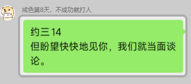
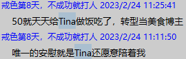
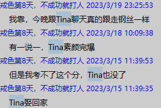
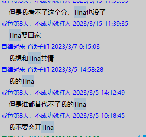

# 章哥恋爱状态社会调研
## 四月记录
## 👇4月21日当日数据

### 常量数据

聊天120min 通话0min
120min聊天 3000字了

### 新增加权算法

章哥对于统计有点反感了，但是数据还是有的，此后的均属按天加权计算，今天的权值因为章哥的心理影响权重缩为0.8，此后每天权值加0.02，没有消极情绪，加到1停止，有消极情绪则再次缩为0.8。

### 对话图片数据

## 👇4月21日前
### 现有数据

现通话2000min 对话交流

网络聊天20w字 文本交流

一对一见面6hour 现实交流

最近3天关键话题含Tina率83%(5/6)  

### 章哥状态

十分喜爱，多次用对话方式的文字进行阐述恋爱的亲密状态，对于对方的评价极高，纯爱战士状态。

### 样例

